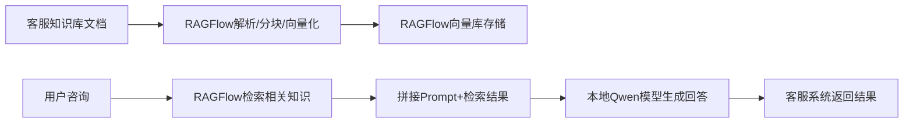

# 本地化客服专用 RAG 系统搭建方案

### 一、整体方案思路

我们将搭建一套**本地化部署**的客服专用RAG系统，核心是「RAGFlow（文档处理/检索） + 本地通义千问（Qwen）小模型 + 客服系统API对接」，全程不依赖外网，数据私有化，适配企业客服场景。

#### 核心流程


---

### 二、前置环境准备

#### 1. 硬件要求（最低）

- CPU：8核16线程（推荐16核）

- 内存：32GB（推荐64GB）

- GPU：NVIDIA显卡（≥16GB显存，如3090/4090/A10），无GPU可纯CPU运行（速度慢）

- 磁盘：100GB以上可用空间

#### 2. 软件依赖

```Bash

# 1. 安装Docker（必装，用于部署RAGFlow）
curl -fsSL https://get.docker.com | sh
systemctl start docker && systemctl enable docker

# 2. 安装Docker Compose
pip install docker-compose

# 3. 安装Python环境（≥3.9）
conda create -n rag-cs python=3.9
conda activate rag-cs

# 4. 安装依赖包（后续对接模型/客服系统用）
pip install transformers accelerate sentencepiece modelscope flask requests
```

---

### 三、步骤1：本地部署RAGFlow（文档检索核心）

#### 1. 克隆并启动RAGFlow

```Bash

# 1. 克隆仓库
git clone https://github.com/infiniflow/ragflow.git
cd ragflow

# 2. 启动RAGFlow（一键部署，包含向量库/前端/后端）
docker-compose up -d

# 3. 检查启动状态（所有容器为Up即成功）
docker-compose ps
```

#### 2. 配置RAGFlow知识库

1. 访问RAGFlow前端：浏览器打开 `http://localhost:8080`

2. 注册并登录（默认管理员账号：[admin@ragflow.io](mailto:admin@ragflow.io)，密码：ragflow123）

3. 创建「客服知识库」：

    - 点击「知识库」→「新建」，命名为「客服专用知识库」

    - 上传客服相关文档（如产品手册、常见问题、售后政策等，支持PDF/Word/TXT等）

    - 等待文档解析、分块、向量化完成（默认用BGE模型，本地化无外网依赖）

---

### 四、步骤2：本地部署通义千问（Qwen）小模型

#### 1. 下载Qwen小模型（推荐Qwen-7B-Chat，轻量化且够用）

```Python

# 新建download_qwen.py，执行下载
from modelscope.hub.snapshot_download import snapshot_download

# 下载Qwen-7B-Chat到本地目录
model_dir = snapshot_download(
    "qwen/Qwen-7B-Chat",
    cache_dir="./qwen-models",  # 模型保存路径
    revision="master"
)
print(f"模型下载完成，路径：{model_dir}")
```

运行：`python download_qwen.py`（需约15GB磁盘空间）

#### 2. 加载本地Qwen模型（封装为调用函数）

```Python

# 新建qwen_local.py，封装模型调用
import torch
from transformers import AutoTokenizer, AutoModelForCausalLM

# 加载模型和Tokenizer
def load_qwen_model(model_path="./qwen-models/qwen/Qwen-7B-Chat"):
    # 设备配置：优先GPU，无则CPU
    device = "cuda" if torch.cuda.is_available() else "cpu"
    
    # 加载Tokenizer
    tokenizer = AutoTokenizer.from_pretrained(
        model_path,
        trust_remote_code=True
    )
    
    # 加载模型（量化配置，降低显存占用）
    model = AutoModelForCausalLM.from_pretrained(
        model_path,
        torch_dtype=torch.float16 if torch.cuda.is_available() else torch.float32,
        device_map="auto",
        trust_remote_code=True,
        load_in_8bit=True  # 8位量化，显存占用降至8GB左右
    )
    return model, tokenizer, device

# 生成回答函数
def generate_answer(model, tokenizer, device, prompt, max_new_tokens=512):
    # 构建Qwen格式的Prompt
    messages = [
        {"role": "user", "content": prompt}
    ]
    text = tokenizer.apply_chat_template(
        messages,
        tokenize=False,
        add_generation_prompt=True
    )
    model_inputs = tokenizer([text], return_tensors="pt").to(device)
    
    # 生成回答
    generated_ids = model.generate(
        **model_inputs,
        max_new_tokens=max_new_tokens,
        do_sample=True,
        temperature=0.7,
        top_p=0.8
    )
    generated_ids = [
        output_ids[len(input_ids):] for input_ids, output_ids in zip(model_inputs.input_ids, generated_ids)
    ]
    response = tokenizer.batch_decode(generated_ids, skip_special_tokens=True)[0]
    return response

# 测试模型
if __name__ == "__main__":
    model, tokenizer, device = load_qwen_model()
    test_prompt = "你好，请问如何退换货？"
    answer = generate_answer(model, tokenizer, device, test_prompt)
    print(f"回答：{answer}")
```

---

### 五、步骤3：对接RAGFlow + Qwen + 客服系统

#### 1. 调用RAGFlow检索接口（获取相关知识库内容）

```Python

# 在qwen_local.py中新增检索函数
import requests

# RAGFlow检索配置
RAGFLOW_URL = "http://localhost:8080/api/v1/retrieve"
RAGFLOW_API_KEY = "你的RAGFlow API密钥"  # 在RAGFlow后台→个人中心→API密钥获取
KB_ID = "你的客服知识库ID"  # 在RAGFlow知识库页面查看

def ragflow_retrieve(query):
    """调用RAGFlow检索相关知识"""
    headers = {
        "Authorization": f"Bearer {RAGFLOW_API_KEY}",
        "Content-Type": "application/json"
    }
    data = {
        "query": query,
        "kb_id": KB_ID,
        "top_k": 3,  # 检索前3条最相关内容
        "score_threshold": 0.5  # 相似度阈值，过滤低相关结果
    }
    try:
        response = requests.post(RAGFLOW_URL, json=data, headers=headers)
        response.raise_for_status()
        results = response.json()
        
        # 提取检索结果文本
        context = "\n".join([item["content"] for item in results["data"]])
        return context
    except Exception as e:
        print(f"检索失败：{e}")
        return ""
```

#### 2. 整合RAG+Qwen，提供客服系统对接API

```Python

# 在qwen_local.py中新增Flask API（供客服系统调用）
from flask import Flask, request, jsonify

app = Flask(__name__)

# 预加载模型（避免每次请求重新加载）
model, tokenizer, device = load_qwen_model()

@app.route("/cs/chat", methods=["POST"])
def cs_chat():
    """客服系统对接接口"""
    try:
        # 接收客服系统的用户咨询
        data = request.get_json()
        user_query = data.get("query", "")
        if not user_query:
            return jsonify({"code": 400, "msg": "查询内容为空", "answer": ""})
        
        # 1. RAGFlow检索相关知识
        context = ragflow_retrieve(user_query)
        
        # 2. 拼接Prompt（问题+检索上下文）
        prompt = f"""
        你是专业的客服助手，根据以下参考资料回答用户问题，仅使用资料中的信息，不要编造内容。
        参考资料：
        {context if context else '无相关参考资料'}
        
        用户问题：{user_query}
        """
        
        # 3. 调用Qwen生成回答
        answer = generate_answer(model, tokenizer, device, prompt)
        
        # 4. 返回给客服系统
        return jsonify({
            "code": 200,
            "msg": "success",
            "answer": answer,
            "context": context  # 可选：返回检索依据，方便客服核验
        })
    except Exception as e:
        return jsonify({"code": 500, "msg": f"服务异常：{str(e)}", "answer": ""})

if __name__ == "__main__":
    # 启动API服务，供客服系统调用
    app.run(host="0.0.0.0", port=5000, debug=False)
```

#### 3. 客服系统对接示例

客服系统只需通过HTTP POST请求调用上述接口即可：

```Bash

# 测试调用（客服系统可按此格式对接）
curl -X POST http://localhost:5000/cs/chat \
-H "Content-Type: application/json" \
-d '{"query": "请问产品保修多久？"}'
```

---

### 六、优化建议（适配客服场景）

1. **模型轻量化**：若GPU显存不足，改用Qwen-1.8B-Chat，显存占用仅4GB左右。

2. **检索优化**：在RAGFlow中开启「混合检索（向量+BM25）」，提升客服问题检索准确率。

3. **话术定制**：在Prompt中加入客服话术规范（如“语气友好、简洁明了”）。

4. **缓存机制**：对高频问题（如“退换货政策”）增加缓存，减少模型调用耗时。

5. **日志监控**：记录用户问题和回答，定期优化知识库和Prompt。

---

### 总结

1. **核心架构**：通过RAGFlow本地化处理客服文档（解析/向量化/检索），结合本地Qwen小模型生成回答，最终通过Flask API对接客服系统，全程私有化部署。

2. **关键步骤**：先部署RAGFlow并导入知识库，再加载本地Qwen模型，最后整合检索+生成能力提供API接口供客服系统调用。

3. **适配优化**：优先选择轻量化Qwen模型，开启混合检索，定制客服话术Prompt，提升系统响应速度和回答准确性。
> （注：文档部分内容可能由 AI 生成）